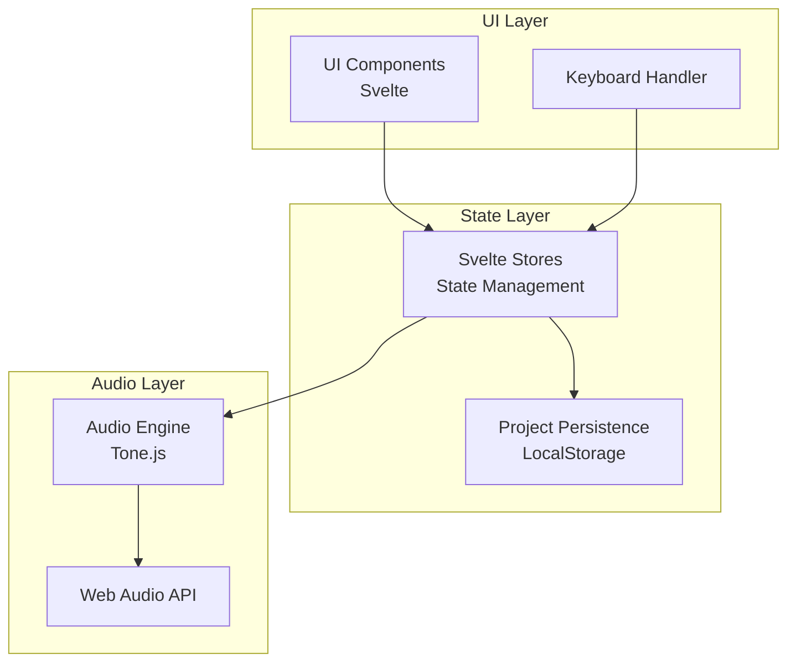
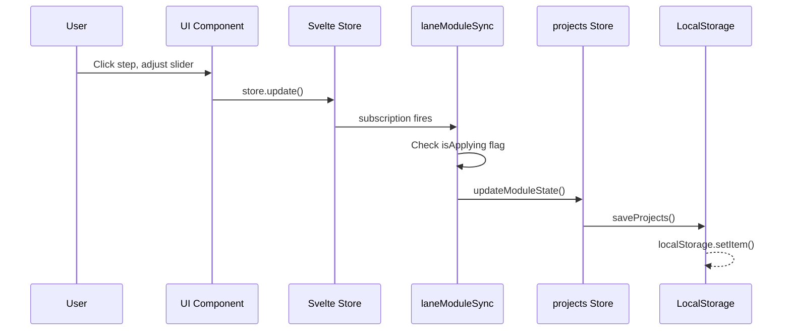
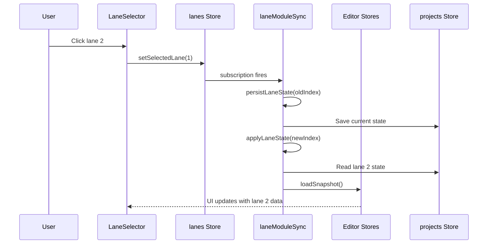

# Lift-Boy Architecture

## Overview

Lift-Boy is a browser-based polyphonic audio sequencer built with:
- **Frontend**: Svelte 5 + TypeScript + Vite
- **Audio Engine**: Tone.js (Web Audio API wrapper)
- **State Management**: Svelte stores (writable + derived)
- **Persistence**: Browser LocalStorage

## System Architecture



## Core Concepts

### 1. Lane-Based Architecture

Lift-Boy uses a **multi-lane architecture** where each lane represents an independent voice:

```
Lane 1: [Rhythm Module] → [Melody Module] → [Instrument] → [Effect] → Mixer
Lane 2: [Rhythm Module] → [Melody Module] → [Instrument] → [Effect] → Mixer
Lane 3: [Rhythm Module] → [Melody Module] → [Instrument] → [Effect] → Mixer
Lane 4: [Rhythm Module] → [Melody Module] → [Instrument] → [Effect] → Mixer
                                                                         ↓
                                                                    Master Out
```

Each lane has:
- **Rhythm Module**: Generates trigger patterns
  - `rhythm.xox-basic` - Traditional step sequencer
  - `rhythm.euclidean` - Bjorklund algorithm generator
  - `rhythm.m185` - Entry-based sequencer
- **Melody Module**: Generates note sequences
  - `melody.melody-basic` - 32-bar pitch sequence
  - `melody.stochastic` - Probability-based random notes
- **Instrument Module**: Synthesizes audio
  - `instrument.synth-simple` - FM synthesizer with ADSR
  - `instrument.kick` - Bass drum synthesizer
  - `instrument.hihat` - Metallic hi-hat synthesizer
  - `instrument.snare` - Snare drum synthesizer
  - `instrument.conga` - Tuned conga drum synthesizer
  - `instrument.clap` - Hand clap synthesizer
- **Effect Module**: Processes audio
  - `effect.delay` - Feedback delay
  - `effect.reverb` - Room simulation
  - `effect.none` - No effect (bypass)
- **Mixer Settings**: Volume, pan, mode (on/mute/solo)

**Parallel Processing**: Each lane runs independently with its own `LaneRuntime` containing separate audio nodes, loops, and state.

**Lane Management**:
- Projects support 1-12 lanes (defined in `PROJECT_LANE_LIMIT` constant)
- Lanes are displayed in a centered carousel in the LaneSelector component
- Selected lane is always visually centered with adjacent lanes visible at reduced opacity
- Adding a lane automatically selects the newly created lane
- Removing lanes preserves selection if possible, otherwise selects the last remaining lane

### 2. Dual State System

The application maintains two parallel state representations:

**Editor State** (UI Stores):
- Module-specific stores for current lane only:
  - `rhythm/stores/sequencer.ts`, `euclidean.ts`, `m185.ts` - Rhythm editors
  - `melody/stores/melody.ts`, `stochastic.ts` - Melody editors
  - `instrument/stores/synth.ts` - Synth parameters
  - `effect/stores/delay.ts`, `reverb.ts` - Effect parameters
- **Purpose**: Active editing, real-time UI updates

**Persisted State** (Projects Store):
- `core/stores/data/projects.ts` - All saved projects and lanes
- `lane.modules[category].state` - Serialized module snapshots
- **Purpose**: Multi-project support, browser persistence

**Module-Aware Synchronization**: `laneModuleSync.ts` detects active module type and loads/saves appropriate snapshots (see [State Management](STATE_MANAGEMENT.md)).

### 3. Module System

Modules are pluggable definitions registered in `modules/registry.ts`:

```typescript
{
  id: "rhythm.xox-basic",
  category: "rhythm",
  version: 1,
  defaultState: { steps: [...], settings: {...} }
}
```

Each lane has 4 module slots (rhythm, melody, instrument, effect). Modules define:
- **Definition**: Static metadata (id, category, version)
- **State**: Dynamic parameters (serialized as JSON)

See [Modules Documentation](MODULES.md) for details.

## Directory Structure

```
src/lib/
├── core/
│   ├── audio/
│   │   └── engine.ts                    # Audio engine with module dispatching
│   ├── components/
│   │   ├── lanes/
│   │   │   └── LaneSelector.svelte      # Multi-lane mixer UI
│   │   └── ui/
│   │       ├── Header.svelte            # Transport controls
│   │       ├── Inputs.svelte            # Universal control component
│   │       └── ModuleSelector.svelte    # Module switching UI
│   ├── modules/
│   │   └── registry.ts                  # Module registry
│   ├── services/
│   │   └── projectPersistence.ts        # LocalStorage API
│   ├── stores/
│   │   ├── data/
│   │   │   └── projects.ts              # Project & lane persistence
│   │   ├── session/
│   │   │   ├── lanes.ts                 # Lane selection & mixer
│   │   │   ├── transport.ts             # BPM/tempo control
│   │   │   ├── playback.ts              # Playback indicators
│   │   │   ├── navigation.ts            # UI scroll tracking
│   │   │   └── moduleSelection.ts       # Module picker state
│   │   └── sync/
│   │       └── laneModuleSync.ts        # Module-aware sync layer
│   ├── types/
│   │   ├── types.ts                     # UI types
│   │   └── project.ts                   # Data models
│   └── utils/
│       ├── keyboard.ts                  # Keyboard dispatcher
│       ├── scrolling.ts                 # Scroll utilities
│       └── constants.ts                 # App constants
├── rhythm/
│   ├── components/
│   │   ├── XoxSequencer.svelte          # Step sequencer UI
│   │   ├── EuclideanSequencer.svelte    # Euclidean UI
│   │   └── M185Sequencer.svelte         # M185 UI
│   ├── stores/
│   │   ├── sequencer.ts                 # XOX state
│   │   ├── euclidean.ts                 # Euclidean state
│   │   └── m185.ts                      # M185 state
│   └── types.ts                         # Rhythm types
├── melody/
│   ├── components/
│   │   ├── MelodySequencer.svelte       # Bar sequencer UI
│   │   └── StochasticSequencer.svelte   # Stochastic UI
│   ├── stores/
│   │   ├── melody.ts                    # Melody state
│   │   └── stochastic.ts                # Stochastic state
│   └── types.ts                         # Melody types
├── instrument/
│   ├── components/
│   │   ├── SimpleSynth.svelte           # Synth UI
│   │   ├── KickDrum.svelte              # Kick drum UI
│   │   ├── HihatDrum.svelte             # Hi-hat UI
│   │   ├── SnareDrum.svelte             # Snare drum UI
│   │   ├── CongaDrum.svelte             # Conga drum UI
│   │   └── ClapDrum.svelte              # Clap UI
│   ├── stores/
│   │   ├── synth.ts                     # Synth state
│   │   ├── kick.ts                      # Kick drum state
│   │   ├── hihat.ts                     # Hi-hat state
│   │   ├── snare.ts                     # Snare drum state
│   │   ├── conga.ts                     # Conga drum state
│   │   └── clap.ts                      # Clap state
│   └── types.ts                         # Instrument types
└── effect/
    ├── components/
    │   ├── DelayEffect.svelte           # Delay UI
    │   ├── ReverbEffect.svelte          # Reverb UI
    │   └── NoneEffect.svelte            # No effect placeholder UI
    ├── stores/
    │   ├── delay.ts                     # Delay state
    │   └── reverb.ts                    # Reverb state
    └── types.ts                         # Effect types
```

## Data Flow Diagrams

### User Edit Flow



### Lane Switch Flow



### Audio Playback Flow

```mermaid
sequenceDiagram
    participant User
    participant Transport as Tone.Transport
    participant Loop as Tone.Loop
    participant Engine as Audio Engine
    participant Runtime as LaneRuntime
    participant Synth as FMSynth

    User->>Transport: Press Play
    Transport->>Transport: Start clock
    loop Every subdivision
        Transport->>Loop: Fire callback
        Loop->>Engine: tickLane()
        Engine->>Runtime: Read step[pointer]
        alt Step active & probability pass
            Engine->>Runtime: Advance melody pointer
            Engine->>Runtime: Read bar[melodyPointer]
            Engine->>Engine: Calculate MIDI note
            Engine->>Synth: triggerAttackRelease()
            Synth-->>Synth: Generate audio
        end
        Engine->>Runtime: Advance step pointer
    end
```

## Component Hierarchy

```
App.svelte
├── Header.svelte
│   ├── BpmDisplay.svelte
│   └── (play/pause/stop buttons)
└── .lane-stage (scroll container)
    ├── LaneSelector.svelte (lane mixer & settings)
    └── <section> (module sections - one per module type)
        ├── XoxSequencer.svelte
        │   └── Inputs.svelte (step parameters)
        ├── MelodySequencer.svelte
        │   └── Inputs.svelte (bar parameters)
        └── SimpleSynth.svelte
            └── Inputs.svelte (synth parameters)
```

**Flat Scroll Architecture**:
- LaneSelector and module sections are siblings in `.lane-stage` scroll container
- Vertical scrolling navigates between sections (up/down arrows)
- Horizontal scrolling within sections navigates slides (left/right arrows)
- IntersectionObserver automatically tracks which section is visible

### Component Communication

**Direct Store Subscription**:
```svelte
<script>
  import { steps } from '$lib/stores/sequencer';
</script>
{#each $steps as step}
  ...
{/each}
```

**Custom Keyboard Events**:
```typescript
// keyboard.ts dispatches
window.dispatchEvent(new CustomEvent('keyboard:arrow-down'));

// Component subscribes
onKeyboardEvent('arrow-down', () => {...});
```

**Derived Stores**:
```typescript
export const activeStep = derived(
  [steps, selectedStep],
  ([$steps, $selected]) => $steps[$selected]
);
```

**Viewport-Based State Management**:
```typescript
// App.svelte uses IntersectionObserver to automatically sync state
viewportObserver = new IntersectionObserver(
  (entries) => {
    for (const entry of entries) {
      if (entry.isIntersecting && entry.intersectionRatio >= 0.6) {
        // Activate LaneSelector or set current module section
        // based on what's visible in viewport
      }
    }
  },
  { root: laneStageElement, threshold: [0.6] }
);
```

This ensures keyboard input routing (tap 1-4 to increment, hold 1-4 + arrows to adjust) always targets the visible section without manual state management. The keyboard system uses tap detection (<200ms threshold) to differentiate between quick increments and hold-for-adjustment workflows.

## State Management Principles

### 1. Single Source of Truth
- **Editor stores**: Ephemeral, active editing state
- **projects store**: Persistent, single source for saved data
- **Sync layer**: Bridges the two (laneModuleSync.ts)

### 2. Immutable Updates
```typescript
// GOOD: Use store.update()
steps.update(s => s.map((step, i) =>
  i === index ? { ...step, active: !step.active } : step
));

// BAD: Direct mutation
$steps[index].active = !$steps[index].active;
```

### 3. Snapshot Pattern
All persisted state uses JSON-serializable snapshots:
```typescript
interface SequencerSnapshot {
  steps: StepState[];
  settings: SequencerSettings;
}
```

## Audio Engine Architecture

See [Audio Engine Documentation](AUDIO_ENGINE.md) for detailed explanation.

**Key Concepts**:
- **LaneRuntime**: Internal representation of a lane's audio state
- **Tone.Loop**: Per-lane timing loop
- **Pointers**: Track current step/bar position
- **Sanitization**: Validates loaded state before use
- **Async Reverb**: Reverb nodes require async impulse response generation
  - `ensureLaneNodes()` awaits `reverb.generate()`
  - Decay/roomSize changes require rebuilding the reverb node
  - Use `rebuildReverbNode()` helper for parameter changes

## Module Categories

| Category | Module ID | Purpose | State Content |
|----------|-----------|---------|---------------|
| `rhythm` | `rhythm.xox-basic` | 64-step trigger pattern | Steps, length, clock, order, probability |
| `rhythm` | `rhythm.euclidean` | Bjorklund algorithm | Steps, pulses, rotation, clock |
| `rhythm` | `rhythm.m185` | Entry-based triggers | Entries, modes, steps per entry, clock |
| `melody` | `melody.melody-basic` | 32-bar pitch sequence | Bars, length, skip, order, glide, randomize |
| `melody` | `melody.stochastic` | Random note generator | Min/max note, change probability, clock |
| `instrument` | `instrument.synth-simple` | FM synthesizer | Wave, harmonicity, mod, envelope, portamento |
| `instrument` | `instrument.kick` | Bass drum synthesizer | Pitch, pitch decay, tone, decay |
| `instrument` | `instrument.hihat` | Metallic hi-hat synthesizer | Tone, decay, resonance |
| `instrument` | `instrument.snare` | Snare drum synthesizer | Tone, snap, decay |
| `instrument` | `instrument.conga` | Tuned conga drum synthesizer | Pitch, pitch decay, tone, decay |
| `instrument` | `instrument.clap` | Hand clap synthesizer | Tone, decay, spread |
| `effect` | `effect.delay` | Feedback delay | Time, feedback, mix |
| `effect` | `effect.reverb` | Room simulation | Room size, decay, mix, pre-delay |
| `effect` | `effect.none` | No processing | (empty) |

**Constraint**: Each lane has exactly one module per category.

**Integration**: The audio engine uses module-aware dispatching - `tickLane()` routes to different handlers based on active `rhythmId`/`melodyId`, and the sync layer saves/loads module-specific snapshots.

## Key Design Decisions

See [Architectural Decision Records](adr/) for detailed rationale:

- [ADR 0001: Lane-Based Architecture](adr/0001-lane-architecture.md)
- [ADR 0002: Snapshot Serialization](adr/0002-snapshot-serialization.md)
- [ADR 0003: Store-Based State Management](adr/0003-store-based-state.md)

## Persistence Schema

**LocalStorage Key**: `liftboy.projects.v1`

**Structure**:
```json
{
  "projects": [
    {
      "id": "uuid",
      "name": "My Project",
      "tempo": 120,
      "lanes": [
        {
          "id": "uuid",
          "name": "Lane 1",
          "order": 0,
          "modules": {
            "rhythm": {
              "id": "uuid",
              "definitionId": "rhythm.xox-basic",
              "state": { "steps": [...], "settings": {...} },
              "bypassed": false
            },
            "melody": {...},
            "instrument": {...},
            "effect": {...}
          },
          "mixer": {
            "volume": 0.8,
            "pan": 0,
            "mode": "on"
          }
        }
      ],
      "meta": {
        "createdAt": "2025-01-15T10:30:00Z",
        "updatedAt": "2025-01-15T12:45:00Z"
      }
    }
  ],
  "activeProjectId": "uuid"
}
```

## Performance Considerations

### Audio Timing
- Tone.Transport provides sample-accurate scheduling
- UI updates scheduled separately via `scheduleUIUpdate()`
- Prevents UI lag from blocking audio thread

### State Sync
- `isApplying` guard prevents circular updates
- Subscriptions batched via Svelte's reactivity
- LocalStorage writes debounced (handled by store)

### Component Rendering
- Derived stores minimize recalculations
- IntersectionObserver for scroll-based visibility
- Conditional rendering for off-screen elements

## Extension Points

### Adding a Custom Module

1. Define module in `modules/registry.ts`:
```typescript
registerModule({
  id: "rhythm.custom-pattern",
  category: "rhythm",
  version: 1,
  defaultState: { /* your state */ }
});
```

2. Update `engine.ts` to handle new module type
3. Create UI component for editing
4. Add sanitization function for state validation

### Adding a New Effect

1. Register in module registry
2. Update `ensureLaneNodes()` in engine.ts
3. Connect Tone.js effect node in audio graph
4. Create parameter UI component

## Testing Strategy

**Current State**: Manual testing only

**Recommended**:
- Unit tests for store functions (snapshot/load)
- Integration tests for sync mechanism
- E2E tests for keyboard navigation
- Audio tests for timing accuracy (Tone.Transport)

## Build & Deployment

```bash
npm run dev       # Development server
npm run build     # Production build (static)
npm run preview   # Preview production build
npm run check     # TypeScript + Svelte check
```

**Output**: Static files in `dist/` (can deploy to any static host)

## Browser Compatibility

**Requires**:
- Web Audio API support (Chrome 34+, Firefox 25+, Safari 14.1+)
- ES6+ JavaScript
- LocalStorage API
- Modern CSS (Grid, Flexbox)

**Not Supported**: IE11, older mobile browsers

## Further Reading

- [Audio Engine Documentation](AUDIO_ENGINE.md)
- [State Management](STATE_MANAGEMENT.md)
- [Keyboard System](KEYBOARD.md)
- [Module System](MODULES.md)
- [Type Reference](TYPES.md)
