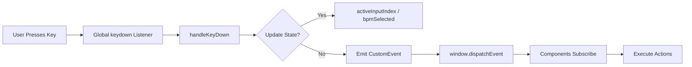
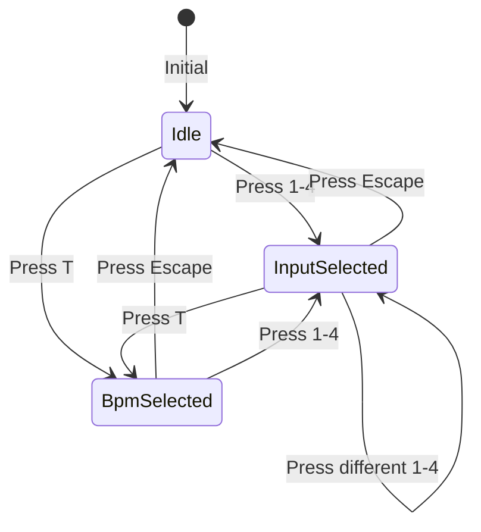
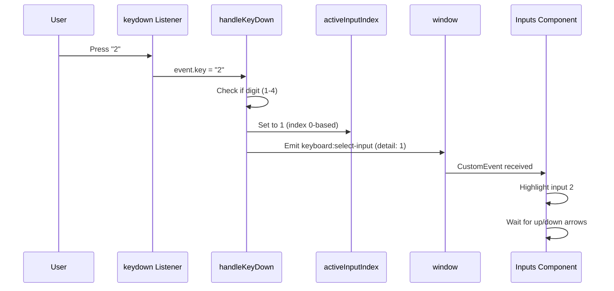
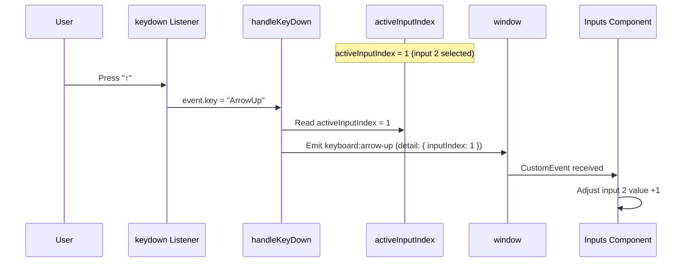

# Keyboard Control System

## Overview

Lift-Boy is designed for **keyboard-first workflow**. The keyboard system (`src/lib/keyboard.ts`) provides:
- Global keydown listener
- Custom event dispatch
- State management for input modes
- Consistent key mappings across components

## Architecture



## Key Mappings

### Navigation

| Key | Event | Action | Context |
|-----|-------|--------|---------|
| `↑` | `keyboard:arrow-up` | Navigate to previous section OR adjust active input | Global |
| `↓` | `keyboard:arrow-down` | Navigate to next section OR adjust active input | Global |
| `←` | `keyboard:arrow-left` | Navigate to previous slide OR adjust active input | Global |
| `→` | `keyboard:arrow-right` | Navigate to next slide OR adjust active input | Global |

### Playback Controls

| Key | Event | Action | Context |
|-----|-------|--------|---------|
| `Space` | `keyboard:toggle-playback` | Play/Pause transport | Global |

### Input Selection

| Key | Event | Action | Context |
|-----|-------|--------|---------|
| `1` | `keyboard:select-input` (detail: 0) | Select first input | Global |
| `2` | `keyboard:select-input` (detail: 1) | Select second input | Global |
| `3` | `keyboard:select-input` (detail: 2) | Select third input | Global |
| `4` | `keyboard:select-input` (detail: 3) | Select fourth input | Global |
| `t` or `T` | `keyboard:select-bpm` | Select BPM input | Global |
| `Escape` | `keyboard:clear-selection` | Clear all selections | Global |

## State Management

### Internal State

The keyboard module maintains two pieces of state:

**activeInputIndex**:
```typescript
let activeInputIndex = writable<number | null>(null);
// null = no input selected
// 0-3 = input 1-4 selected
```

**bpmSelected**:
```typescript
let bpmSelected = writable<boolean>(false);
// true = BPM editing mode active
```

### State Transitions



**State Rules**:
- Only one input or BPM can be selected at a time
- Selecting input clears BPM selection
- Selecting BPM clears input selection
- Escape clears all selections

## Event Flow

### Example: User Presses "2"



### Example: User Adjusts Selected Input



## Event Details

### keyboard:arrow-up / keyboard:arrow-down / keyboard:arrow-left / keyboard:arrow-right

**Dispatched When**: Arrow key pressed

**Event Detail**:
```typescript
{
  inputIndex?: number  // If input selected, which one (0-3)
}
```

**Behavior**:
- If `inputIndex` present → Component adjusts that input's value
- If no `inputIndex` → Component handles as navigation

**Example Usage**:
```typescript
onKeyboardEvent('arrow-up', (detail) => {
  if (detail?.inputIndex !== undefined) {
    // Adjust input value
    adjustInputValue(detail.inputIndex, +1);
  } else {
    // Navigate to previous section
    navigateSection(-1);
  }
});
```

### keyboard:select-input

**Dispatched When**: Number key 1-4 pressed

**Event Detail**:
```typescript
{
  inputIndex: number  // 0-3
}
```

**Behavior**: Component highlights specified input for editing

**Example Usage**:
```typescript
onKeyboardEvent('select-input', (detail) => {
  highlightedInput = detail.inputIndex;
});
```

### keyboard:select-bpm

**Dispatched When**: "T" key pressed

**Event Detail**: None

**Behavior**: Focus BPM input for editing

**Example Usage**:
```typescript
onKeyboardEvent('select-bpm', () => {
  bpmInputFocused = true;
});
```

### keyboard:clear-selection

**Dispatched When**: Escape key pressed

**Event Detail**: None

**Behavior**: Clear all input selections

**Example Usage**:
```typescript
onKeyboardEvent('clear-selection', () => {
  highlightedInput = null;
  bpmInputFocused = false;
});
```

### keyboard:toggle-playback

**Dispatched When**: Space bar pressed

**Event Detail**: None

**Behavior**: Toggle play/pause

**Example Usage**:
```typescript
onKeyboardEvent('toggle-playback', () => {
  if (isPlaying) {
    pause();
  } else {
    play();
  }
});
```

## Component Integration

### Subscribing to Events

**Pattern**:
```typescript
import { onKeyboardEvent } from '$lib/keyboard';
import { onMount } from 'svelte';

onMount(() => {
  const unsubscribe = onKeyboardEvent('arrow-up', (detail) => {
    console.log('Arrow up pressed', detail);
  });

  return unsubscribe;  // Cleanup on unmount
});
```

**Helper Function**:
```typescript
export function onKeyboardEvent(
  eventType: KeyboardEventType,
  callback: (detail?: any) => void
): () => void {
  const handler = (event: Event) => {
    const customEvent = event as CustomEvent;
    callback(customEvent.detail);
  };

  window.addEventListener(`keyboard:${eventType}`, handler);

  // Return cleanup function
  return () => {
    window.removeEventListener(`keyboard:${eventType}`, handler);
  };
}
```

### Reading State

**activeInputIndex**:
```svelte
<script>
  import { activeInputIndex } from '$lib/keyboard';
</script>

{#if $activeInputIndex === 0}
  <div class="highlight">Input 1 selected</div>
{/if}
```

**bpmSelected**:
```svelte
<script>
  import { bpmSelected } from '$lib/keyboard';
</script>

{#if $bpmSelected}
  <input type="number" bind:value={bpm} autofocus />
{/if}
```

## Implementation Details

### keyMap

**Purpose**: Define all valid keys and their event names.

**Structure**:
```typescript
const keyMap: Record<string, string> = {
  'ArrowUp': 'arrow-up',
  'ArrowDown': 'arrow-down',
  'ArrowLeft': 'arrow-left',
  'ArrowRight': 'arrow-right',
  ' ': 'toggle-playback',
  '1': 'select-input',
  '2': 'select-input',
  '3': 'select-input',
  '4': 'select-input',
  't': 'select-bpm',
  'T': 'select-bpm',
  'Escape': 'clear-selection'
};
```

### handleKeyDown

**Flow**:
```typescript
function handleKeyDown(event: KeyboardEvent) {
  const { key } = event;

  // 1. Check if key is mapped
  if (!keyMap[key]) return;

  // 2. Prevent default browser behavior
  event.preventDefault();

  // 3. Handle state updates
  if (key >= '1' && key <= '4') {
    const index = parseInt(key) - 1;
    activeInputIndex.set(index);
    bpmSelected.set(false);
    emitEvent('select-input', { inputIndex: index });
    return;
  }

  if (key === 't' || key === 'T') {
    bpmSelected.set(true);
    activeInputIndex.set(null);
    emitEvent('select-bpm');
    return;
  }

  if (key === 'Escape') {
    activeInputIndex.set(null);
    bpmSelected.set(false);
    emitEvent('clear-selection');
    return;
  }

  // 4. Emit navigation events with context
  const eventName = keyMap[key];
  const detail = get(activeInputIndex) !== null
    ? { inputIndex: get(activeInputIndex) }
    : undefined;

  emitEvent(eventName, detail);
}
```

### emitEvent

**Purpose**: Dispatch custom events on window.

**Implementation**:
```typescript
function emitEvent(eventType: string, detail?: any) {
  const event = new CustomEvent(`keyboard:${eventType}`, { detail });
  window.dispatchEvent(event);
}
```

**Why CustomEvent?**
- Allows passing data via `detail` property
- Standard browser API
- No external dependencies

### Initialization

**Called On**: App mount

```typescript
export function initKeyboard() {
  window.addEventListener('keydown', handleKeyDown);
}

export function destroyKeyboard() {
  window.removeEventListener('keydown', handleKeyDown);
}
```

**Lifecycle**:
```svelte
<!-- App.svelte -->
<script>
  import { onMount, onDestroy } from 'svelte';
  import { initKeyboard, destroyKeyboard } from '$lib/keyboard';

  onMount(() => {
    initKeyboard();
  });

  onDestroy(() => {
    destroyKeyboard();
  });
</script>
```

## Usage Patterns

### Pattern 1: Dual-Mode Arrow Keys

**Scenario**: Arrow keys navigate sections OR adjust inputs based on state.

```typescript
onKeyboardEvent('arrow-up', (detail) => {
  if (detail?.inputIndex !== undefined) {
    // Input editing mode
    adjustInputValue(detail.inputIndex, +1);
  } else {
    // Navigation mode
    navigateSection(-1);
  }
});
```

### Pattern 2: Highlight Selected Input

```svelte
<script>
  import { activeInputIndex } from '$lib/keyboard';

  let inputs = [
    { label: 'Duration', value: 1 },
    { label: 'Probability', value: 100 },
    { label: 'Length', value: 16 },
    { label: 'Subdivision', value: 2 }
  ];
</script>

{#each inputs as input, i}
  <div class:selected={$activeInputIndex === i}>
    {input.label}: {input.value}
  </div>
{/each}
```

### Pattern 3: Conditional Rendering Based on Selection

```svelte
<script>
  import { bpmSelected } from '$lib/keyboard';
</script>

{#if $bpmSelected}
  <div class="bpm-editor">
    <input type="number" bind:value={bpm} min="40" max="240" />
  </div>
{:else}
  <div class="bpm-display">
    {bpm} BPM (press T to edit)
  </div>
{/if}
```

## Accessibility

### Keyboard Navigation

**Best Practices**:
- All features accessible via keyboard
- No mouse required for core functionality
- Visual feedback for selected inputs
- Escape always clears state

**Screen Reader Support**:
- Announce input selection changes
- Label all controls clearly

**Example**:
```svelte
<div
  role="slider"
  aria-label="Step duration"
  aria-valuenow={duration}
  aria-valuemin={0.25}
  aria-valuemax={4}
  class:selected={$activeInputIndex === 0}
>
  Duration: {duration}
</div>
```

### Focus Management

**Issue**: Keyboard events work globally, but native focus indicators may not match.

**Solution**: Use CSS to style `.selected` class to match `:focus`.

```css
.input.selected,
.input:focus {
  outline: 2px solid blue;
  box-shadow: 0 0 0 3px rgba(0, 112, 243, 0.2);
}
```

## Preventing Conflicts

### Browser Shortcuts

Some keys conflict with browser defaults:

| Key | Browser Default | Lift-Boy Override |
|-----|----------------|-------------------|
| Space | Scroll down | Toggle playback |
| Arrow keys | Scroll page | Navigate/adjust |

**Solution**: Call `event.preventDefault()` in `handleKeyDown()`.

### Input Fields

**Problem**: Keydown events fire even when user is typing in text input.

**Solution**: Check `event.target` and ignore if it's an input:

```typescript
function handleKeyDown(event: KeyboardEvent) {
  const target = event.target as HTMLElement;
  if (target.tagName === 'INPUT' || target.tagName === 'TEXTAREA') {
    return;  // Let input handle its own keys
  }

  // ... rest of handler
}
```

**Current Implementation**: Lift-Boy doesn't have text inputs, so this is not needed yet.

## Debugging

### Logging Events

```typescript
onKeyboardEvent('arrow-up', (detail) => {
  console.log('Arrow up:', detail);
});
```

### Checking State

```javascript
// In browser console
import { get } from 'svelte/store';
import { activeInputIndex, bpmSelected } from '$lib/keyboard';

console.log('Active input:', get(activeInputIndex));
console.log('BPM selected:', get(bpmSelected));
```

### Monitoring All Events

```typescript
// Temporary debug helper
const allEventTypes = [
  'arrow-up', 'arrow-down', 'arrow-left', 'arrow-right',
  'toggle-playback', 'select-input', 'select-bpm', 'clear-selection'
];

allEventTypes.forEach(type => {
  window.addEventListener(`keyboard:${type}`, (e: Event) => {
    console.log(type, (e as CustomEvent).detail);
  });
});
```

## Testing

### Unit Tests

**Test State Transitions**:
```typescript
import { activeInputIndex, bpmSelected, handleKeyDown } from '$lib/keyboard';
import { get } from 'svelte/store';

test('Pressing "1" selects first input', () => {
  handleKeyDown({ key: '1', preventDefault: vi.fn() });
  expect(get(activeInputIndex)).toBe(0);
  expect(get(bpmSelected)).toBe(false);
});

test('Pressing "T" selects BPM', () => {
  handleKeyDown({ key: 'T', preventDefault: vi.fn() });
  expect(get(bpmSelected)).toBe(true);
  expect(get(activeInputIndex)).toBe(null);
});

test('Escape clears all selections', () => {
  activeInputIndex.set(2);
  bpmSelected.set(true);
  handleKeyDown({ key: 'Escape', preventDefault: vi.fn() });
  expect(get(activeInputIndex)).toBe(null);
  expect(get(bpmSelected)).toBe(false);
});
```

**Test Event Dispatch**:
```typescript
test('Arrow up emits event with input index', (done) => {
  activeInputIndex.set(1);

  window.addEventListener('keyboard:arrow-up', (e: Event) => {
    const detail = (e as CustomEvent).detail;
    expect(detail.inputIndex).toBe(1);
    done();
  });

  handleKeyDown({ key: 'ArrowUp', preventDefault: vi.fn() });
});
```

### E2E Tests

**Scenario: Navigate and adjust input**:
```typescript
test('User can select and adjust input via keyboard', async () => {
  // Press "2" to select second input
  await page.keyboard.press('2');
  await expect(page.locator('.input:nth-child(2)')).toHaveClass(/selected/);

  // Press up arrow to increase value
  const initialValue = await page.locator('.input:nth-child(2) .value').textContent();
  await page.keyboard.press('ArrowUp');
  const newValue = await page.locator('.input:nth-child(2) .value').textContent();
  expect(newValue).toBeGreaterThan(initialValue);

  // Press Escape to deselect
  await page.keyboard.press('Escape');
  await expect(page.locator('.input:nth-child(2)')).not.toHaveClass(/selected/);
});
```

## Extension Points

### Adding New Key Mappings

1. **Add to keyMap**:
```typescript
const keyMap: Record<string, string> = {
  // ... existing mappings
  'r': 'randomize-pattern',
  'c': 'copy-pattern'
};
```

2. **Handle in handleKeyDown**:
```typescript
if (key === 'r') {
  emitEvent('randomize-pattern');
  return;
}
```

3. **Subscribe in component**:
```typescript
onKeyboardEvent('randomize-pattern', () => {
  randomizeSteps();
});
```

### Custom Input Modes

**Example**: Add "shift mode" for fine-grained adjustments:

```typescript
let shiftPressed = writable(false);

function handleKeyDown(event: KeyboardEvent) {
  if (event.key === 'Shift') {
    shiftPressed.set(true);
  }

  // ... existing logic

  if (event.key === 'ArrowUp') {
    const delta = get(shiftPressed) ? 0.1 : 1;  // Fine vs coarse
    emitEvent('arrow-up', { inputIndex: get(activeInputIndex), delta });
  }
}

function handleKeyUp(event: KeyboardEvent) {
  if (event.key === 'Shift') {
    shiftPressed.set(false);
  }
}
```

## Best Practices

1. **Always prevent default**: Call `event.preventDefault()` to avoid page scrolling
2. **Provide visual feedback**: Show which input is selected
3. **Document key mappings**: In UI and help docs
4. **Use semantic events**: Name events by action, not key (e.g., 'toggle-playback' not 'space-pressed')
5. **Clean up listeners**: Always return unsubscribe function from `onKeyboardEvent()`

## Further Reading

- [Navigation Store](STATE_MANAGEMENT.md#navigationts) - How navigation state is managed
- [Inputs Component](../lib/Inputs.svelte) - Example of keyboard integration
- [MDN: KeyboardEvent](https://developer.mozilla.org/en-US/docs/Web/API/KeyboardEvent)
