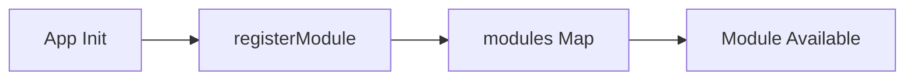
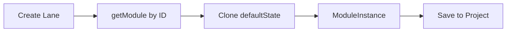
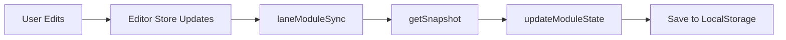

# Module System

## Overview

The module system provides **pluggable, versioned definitions** for rhythm generators, melody sequencers, instruments, and effects. Each lane has four module slots (one per category), allowing flexible routing and future extensibility.

## Architecture

```
Lane
├── [Rhythm Module]    → Generates trigger pattern
├── [Melody Module]    → Generates note sequence
├── [Instrument Module] → Synthesizes audio
└── [Effect Module]    → Processes audio output
```

## Module Categories

| Category | Module ID | Purpose | State Content |
|----------|-----------|---------|---------------|
| `rhythm` | `rhythm.xox-basic` | 64-step trigger pattern | Steps, length, clock, order, probability |
| `rhythm` | `rhythm.euclidean` | Bjorklund algorithm generator | Steps, pulses, rotation, clock |
| `rhythm` | `rhythm.m185` | Entry-based sequencer | Entries, modes, steps per entry, clock |
| `melody` | `melody.melody-basic` | 32-bar pitch sequence | Bars, length, skip, order, glide, randomize |
| `melody` | `melody.stochastic` | Random note generator | Min/max note, change probability, current note, clock |
| `instrument` | `instrument.synth-simple` | FM synthesizer | Wave, harmonicity, mod, envelope, portamento |
| `instrument` | `instrument.kick` | Bass drum synthesizer | Pitch, pitch decay, tone, decay |
| `instrument` | `instrument.hihat` | Metallic hi-hat synthesizer | Tone, decay, resonance |
| `instrument` | `instrument.snare` | Snare drum synthesizer | Tone, snap, decay |
| `instrument` | `instrument.conga` | Tuned conga drum synthesizer | Pitch, pitch decay, tone, decay |
| `instrument` | `instrument.clap` | Hand clap synthesizer | Tone, decay, spread |
| `effect` | `effect.delay` | Feedback delay | Time, feedback, mix |
| `effect` | `effect.reverb` | Room simulation | Room size, decay, mix, pre-delay |
| `effect` | `effect.none` | No processing | (empty, bypass) |

**Constraint**: Each lane has exactly **one module per category**.

**Implementation**: All modules integrated with module-aware dispatching in audio engine and module-aware sync in state layer.

## Module Definition

### ModuleDefinition Interface

```typescript
interface ModuleDefinition {
  id: string;              // Unique identifier (e.g., "rhythm.xox-basic")
  category: ModuleCategory;
  label?: string;          // Display name
  version: number;         // Schema version
  defaultState: unknown;   // Default state snapshot
}

type ModuleCategory = 'rhythm' | 'melody' | 'instrument' | 'effect';
```

### Example: XOX Sequencer Module

```typescript
{
  id: 'rhythm.xox-basic',
  category: 'rhythm',
  label: 'XOX Sequencer',
  version: 1,
  defaultState: {
    steps: [
      { id: 'step-0', active: false, duration: 1, probability: 100 },
      // ... 63 more steps
    ],
    settings: {
      length: 16,
      clockIndex: 2,      // 16th notes
      orderIndex: 0       // Forward
    }
  }
}
```

## Module Instance

### ModuleInstance Interface

```typescript
interface ModuleInstance {
  id: string;              // Unique instance ID (UUID)
  definitionId: string;    // Reference to ModuleDefinition.id
  state: unknown;          // Current state (JSON-serializable)
  bypassed: boolean;       // If true, module is inactive
}
```

### Example: Lane's Rhythm Module Instance

```typescript
{
  id: 'f47ac10b-58cc-4372-a567-0e02b2c3d479',
  definitionId: 'rhythm.xox-basic',
  state: {
    steps: [
      { id: 'step-0', active: true, duration: 1, probability: 100 },
      { id: 'step-1', active: false, duration: 1, probability: 100 },
      // ... modified from defaults
    ],
    settings: {
      length: 32,         // User changed from default 16
      clockIndex: 1,      // User changed to 8th notes
      orderIndex: 0
    }
  },
  bypassed: false
}
```

## Module Registry

### registry.ts

**Purpose**: Central registry of all available modules.

**Structure**:
```typescript
const modules = new Map<string, ModuleDefinition>();

export function registerModule(definition: ModuleDefinition) {
  if (modules.has(definition.id)) {
    console.warn(`Module ${definition.id} already registered`);
    return;
  }
  modules.set(definition.id, definition);
}

export function getModule(id: string): ModuleDefinition | undefined {
  return modules.get(id);
}

export function getModulesByCategory(category: ModuleCategory): ModuleDefinition[] {
  return Array.from(modules.values()).filter(m => m.category === category);
}
```

### Default Modules

**Registered On**: App initialization

```typescript
// Rhythm modules
registerModule({
  id: 'rhythm.xox-basic',
  category: 'rhythm',
  version: 1,
  defaultState: createSequencerSnapshot()
});

registerModule({
  id: 'rhythm.euclidean',
  category: 'rhythm',
  version: 1,
  defaultState: createEuclideanSnapshot()
});

registerModule({
  id: 'rhythm.m185',
  category: 'rhythm',
  version: 1,
  defaultState: createM185Snapshot()
});

// Melody modules
registerModule({
  id: 'melody.melody-basic',
  category: 'melody',
  version: 1,
  defaultState: createMelodySnapshot()
});

registerModule({
  id: 'melody.stochastic',
  category: 'melody',
  version: 1,
  defaultState: createStochasticSnapshot()
});

// Instrument modules
registerModule({
  id: 'instrument.synth-simple',
  category: 'instrument',
  version: 1,
  defaultState: createSynthSnapshot()
});

registerModule({
  id: 'instrument.kick',
  category: 'instrument',
  version: 1,
  defaultState: createKickSnapshot()
});

registerModule({
  id: 'instrument.hihat',
  category: 'instrument',
  version: 1,
  defaultState: createHihatSnapshot()
});

registerModule({
  id: 'instrument.snare',
  category: 'instrument',
  version: 1,
  defaultState: createSnareSnapshot()
});

registerModule({
  id: 'instrument.conga',
  category: 'instrument',
  version: 1,
  defaultState: createCongaSnapshot()
});

registerModule({
  id: 'instrument.clap',
  category: 'instrument',
  version: 1,
  defaultState: createClapSnapshot()
});

// Effect modules
registerModule({
  id: 'effect.delay',
  category: 'effect',
  version: 1,
  defaultState: createDelaySnapshot()
});

registerModule({
  id: 'effect.reverb',
  category: 'effect',
  version: 1,
  defaultState: createReverbSnapshot()
});

registerModule({
  id: 'effect.none',
  category: 'effect',
  version: 1,
  defaultState: {}
});
```

## Module Lifecycle

### 1. Module Registration



Called once on app startup.

### 2. Module Instance Creation



When user creates a lane, instances are created from definitions.

### 3. State Hydration

```mermaid
graph LR
    LoadProject[Load Project] --> ReadState[Read lane.modules[category].state]
    ReadState --> Validate[Sanitize/Validate]
    Validate --> Apply[Apply to Runtime]
```

When project loads, module states hydrate audio engine.

### 4. State Persistence



Changes in editor stores persist to module state.

## State Snapshots

### Purpose

Snapshots provide a **serializable representation** of module state:
- JSON-compatible (no functions, classes, or circular refs)
- Versionable (can add schema migrations)
- Immutable by convention (return new objects, don't mutate)

### Snapshot Functions

Each module category has corresponding snapshot functions:

**Rhythm (Sequencer)**:
```typescript
// In stores/sequencer.ts
export function createSequencerSnapshot(): SequencerSnapshot {
  return {
    steps: Array.from({ length: 64 }, (_, i) => ({
      id: `step-${i}`,
      active: false,
      duration: 1,
      probability: 100
    })),
    settings: {
      length: 16,
      clockIndex: 2,
      orderIndex: 0
    }
  };
}

export function getSequencerSnapshot(): SequencerSnapshot {
  return {
    steps: get(steps).map(s => ({ ...s })),
    settings: { ...get(sequencerSettings) }
  };
}

export function loadSequencerSnapshot(snapshot?: SequencerSnapshot) {
  const safeSnapshot = snapshot ?? createSequencerSnapshot();
  steps.set(safeSnapshot.steps.map(s => ({ ...s })));
  sequencerSettings.set({ ...safeSnapshot.settings });
}
```

**Melody**:
```typescript
// In stores/melody.ts
export function createMelodySnapshot(): MelodySnapshot { /* ... */ }
export function getMelodySnapshot(): MelodySnapshot { /* ... */ }
export function loadMelodySnapshot(snapshot?: MelodySnapshot) { /* ... */ }
```

**Instrument (Synth)**:
```typescript
// In stores/synth.ts
export function createSynthSnapshot(): SynthSnapshot { /* ... */ }
export function getSynthSnapshot(): SynthSnapshot { /* ... */ }
export function loadSynthSnapshot(snapshot?: SynthSnapshot) { /* ... */ }
```

## Adding a Custom Module

### Step 1: Define Module State

```typescript
// In a new file: stores/arpeggiator.ts
export interface ArpeggiatorSnapshot {
  pattern: number[];    // Arpeggio pattern (semitone offsets)
  rate: number;         // Notes per beat
  octaves: number;      // Octave range
  direction: 'up' | 'down' | 'up-down';
}

export function createArpeggiatorSnapshot(): ArpeggiatorSnapshot {
  return {
    pattern: [0, 4, 7],  // Major triad
    rate: 4,             // 16th notes
    octaves: 2,
    direction: 'up'
  };
}
```

### Step 2: Register Module

```typescript
// In modules/registry.ts or a custom registry file
import { createArpeggiatorSnapshot } from '$lib/stores/arpeggiator';

registerModule({
  id: 'melody.arpeggiator',
  category: 'melody',
  label: 'Arpeggiator',
  version: 1,
  defaultState: createArpeggiatorSnapshot()
});
```

### Step 3: Update Audio Engine

```typescript
// In audio/engine.ts
function triggerLaneMelody(runtime: LaneRuntime, step: StepState, time: number) {
  const melodyModule = runtime.melody;  // ModuleInstance

  // Check which melody module is active
  if (melodyModule.definitionId === 'melody.arpeggiator') {
    const state = melodyModule.state as ArpeggiatorSnapshot;
    triggerArpeggio(runtime, step, state, time);
  } else if (melodyModule.definitionId === 'melody.melody-basic') {
    // Existing melody logic
    triggerMelodyBar(runtime, step, time);
  }
}

function triggerArpeggio(
  runtime: LaneRuntime,
  step: StepState,
  state: ArpeggiatorSnapshot,
  time: number
) {
  const { pattern, rate, octaves, direction } = state;

  // Generate arpeggio notes based on pattern
  const notes = generateArpeggioNotes(pattern, octaves, direction);

  // Schedule notes at specified rate
  const interval = (60 / get(bpm)) / rate;  // Seconds per note
  notes.forEach((note, i) => {
    const noteTime = time + (i * interval);
    runtime.synth.triggerAttackRelease(note, interval * 0.9, noteTime);
  });
}
```

### Step 4: Create UI Component

```svelte
<!-- ArpeggiatorSequencer.svelte -->
<script lang="ts">
  import type { ArpeggiatorSnapshot } from '$lib/stores/arpeggiator';

  // This would need to be wired into laneModuleSync
  let state: ArpeggiatorSnapshot = {
    pattern: [0, 4, 7],
    rate: 4,
    octaves: 2,
    direction: 'up'
  };

  function adjustPattern(index: number, delta: number) {
    state.pattern[index] = Math.max(0, Math.min(12, state.pattern[index] + delta));
  }
</script>

<div class="arpeggiator">
  <h3>Arpeggiator</h3>

  <div class="pattern">
    {#each state.pattern as note, i}
      <button on:click={() => adjustPattern(i, 1)}>
        +{note}
      </button>
    {/each}
  </div>

  <div class="controls">
    <label>
      Rate: {state.rate}
      <input type="range" bind:value={state.rate} min="1" max="16" />
    </label>

    <label>
      Octaves: {state.octaves}
      <input type="range" bind:value={state.octaves} min="1" max="4" />
    </label>

    <select bind:value={state.direction}>
      <option value="up">Up</option>
      <option value="down">Down</option>
      <option value="up-down">Up-Down</option>
    </select>
  </div>
</div>
```

### Step 5: Wire into laneModuleSync

```typescript
// In stores/laneModuleSync.ts (hypothetical extension)
import { arpeggiatorStore } from './arpeggiator';
import { getArpeggiatorSnapshot, loadArpeggiatorSnapshot } from './arpeggiator';

function persistLaneState(laneIndex: number) {
  // ... existing persists

  // Determine which melody module is active
  const lane = get(currentLanes)[laneIndex];
  if (lane.modules.melody.definitionId === 'melody.arpeggiator') {
    const arpSnapshot = getArpeggiatorSnapshot();
    updateModuleState(laneIndex, 'melody', arpSnapshot);
  }
}

function applyLaneState(laneIndex: number) {
  isApplying = true;

  const lane = get(currentLanes)[laneIndex];

  // ... existing applies

  if (lane.modules.melody.definitionId === 'melody.arpeggiator') {
    loadArpeggiatorSnapshot(lane.modules.melody.state);
  }

  isApplying = false;
}
```

## Module Versioning

### Purpose

As modules evolve, state schemas may change. Versioning allows backward compatibility.

### Version Field

```typescript
{
  id: 'rhythm.xox-basic',
  version: 2,  // Incremented from 1
  defaultState: { /* new schema */ }
}
```

### Migration Strategy

**Option 1: In-Place Migration**

```typescript
export function loadSequencerSnapshot(snapshot?: any) {
  let safeSnapshot = snapshot ?? createSequencerSnapshot();

  // Migrate v1 → v2
  if (!safeSnapshot.version || safeSnapshot.version === 1) {
    safeSnapshot = migrateSequencerV1ToV2(safeSnapshot);
  }

  // Apply v2 state
  steps.set(safeSnapshot.steps);
  sequencerSettings.set(safeSnapshot.settings);
}

function migrateSequencerV1ToV2(v1: any): SequencerSnapshot {
  return {
    ...v1,
    version: 2,
    settings: {
      ...v1.settings,
      swing: 0  // New field in v2
    }
  };
}
```

**Option 2: Version-Specific Loaders**

```typescript
export function loadSequencerSnapshot(snapshot?: any) {
  const version = snapshot?.version ?? 1;

  switch (version) {
    case 1:
      loadSequencerSnapshotV1(snapshot);
      break;
    case 2:
      loadSequencerSnapshotV2(snapshot);
      break;
    default:
      console.error(`Unknown sequencer version: ${version}`);
      loadSequencerSnapshot(createSequencerSnapshot());
  }
}
```

## Module Bypass

### Purpose

Allow disabling modules without removing them.

### Implementation

```typescript
interface ModuleInstance {
  // ...
  bypassed: boolean;
}
```

**In Audio Engine**:
```typescript
function tickLane(runtime: LaneRuntime, time: number) {
  if (runtime.rhythmModule.bypassed) {
    // Don't trigger anything
    return;
  }

  // ... normal logic
}
```

**In UI**:
```svelte
<button on:click={() => toggleBypass('rhythm')}>
  {lane.modules.rhythm.bypassed ? 'Enable' : 'Bypass'} Rhythm
</button>
```

## Module Metadata

### Optional Fields

**label**: Human-readable name
```typescript
{
  id: 'rhythm.xox-basic',
  label: 'XOX Sequencer'  // Displayed in UI
}
```

**description**: Longer explanation
```typescript
{
  id: 'rhythm.xox-basic',
  description: 'Classic step sequencer with per-step duration and probability'
}
```

**author**: Creator info
```typescript
{
  id: 'rhythm.euclidean',
  author: 'Community',
  url: 'https://github.com/...'
}
```

## Future Extensions

### Dynamic Module Loading

```typescript
export async function loadModuleFromUrl(url: string) {
  const response = await fetch(url);
  const moduleCode = await response.text();

  // Use dynamic import or eval (with sandboxing)
  const module = await import(/* @vite-ignore */ url);

  registerModule(module.definition);
}
```

### Module Marketplace

- Host modules on npm or GitHub
- User installs via package manager
- Modules auto-register on import

### Per-Module Presets

```typescript
interface ModulePreset {
  moduleId: string;
  presetName: string;
  state: unknown;
}

const presets: ModulePreset[] = [
  {
    moduleId: 'rhythm.xox-basic',
    presetName: 'Four on the Floor',
    state: {
      steps: [
        { active: true, /* ... */ },
        { active: false, /* ... */ },
        // ... pattern for 4/4 kick
      ]
    }
  }
];
```

### Module Chaining

Allow multiple modules per category:

```
Lane Rhythm: [XOX Sequencer] → [Euclidean Filter] → Triggers
```

**Implementation**:
```typescript
interface Lane {
  modules: {
    rhythm: ModuleInstance[];  // Array instead of single
    // ...
  };
}
```

## Testing Modules

### Unit Tests

**Test Snapshot Creation**:
```typescript
import { createSequencerSnapshot } from '$lib/stores/sequencer';

test('Creates valid sequencer snapshot', () => {
  const snapshot = createSequencerSnapshot();

  expect(snapshot.steps).toHaveLength(64);
  expect(snapshot.settings.length).toBe(16);
  expect(snapshot.steps[0].active).toBe(false);
});
```

**Test Snapshot Loading**:
```typescript
import { loadSequencerSnapshot, steps } from '$lib/stores/sequencer';
import { get } from 'svelte/store';

test('Loads sequencer snapshot', () => {
  const snapshot = {
    steps: [
      { id: 'step-0', active: true, duration: 2, probability: 50 },
      // ...
    ],
    settings: { length: 8, clockIndex: 1, orderIndex: 0 }
  };

  loadSequencerSnapshot(snapshot);

  expect(get(steps)[0].active).toBe(true);
  expect(get(steps)[0].duration).toBe(2);
});
```

### Integration Tests

**Test Module Registration**:
```typescript
import { registerModule, getModule } from '$lib/modules/registry';

test('Registers and retrieves module', () => {
  registerModule({
    id: 'test.module',
    category: 'rhythm',
    version: 1,
    defaultState: {}
  });

  const module = getModule('test.module');
  expect(module).toBeDefined();
  expect(module.category).toBe('rhythm');
});
```

**Test Module Persistence**:
```typescript
test('Module state persists to LocalStorage', () => {
  // Create lane with module
  createLane();

  // Edit module state
  toggleStepActive(0);

  // Save project
  saveProjects();

  // Reload from LocalStorage
  const loaded = loadProjects();

  expect(loaded.projects[0].lanes[0].modules.rhythm.state.steps[0].active)
    .toBe(true);
});
```

## Best Practices

1. **Keep state JSON-serializable**: No functions, classes, or circular refs
2. **Validate on load**: Always sanitize state from LocalStorage
3. **Version your schemas**: Add `version` field for future migrations
4. **Provide defaults**: `createSnapshot()` should return valid defaults
5. **Document state structure**: Add JSDoc or TypeScript interfaces
6. **Test snapshot functions**: Ensure create/get/load roundtrip works

## Troubleshooting

**Issue**: Module state not persisting
- Check `laneModuleSync` is initialized
- Verify `updateModuleState()` is called
- Check `isApplying` guard isn't blocking

**Issue**: Module state corrupted on load
- Add sanitization in `loadSnapshot()` function
- Use `createSnapshot()` as fallback
- Check LocalStorage manually in DevTools

**Issue**: Module not appearing in UI
- Verify module registered in `registry.ts`
- Check `getModulesByCategory()` returns it
- Ensure UI component checks `definitionId`

## Further Reading

- [State Management](STATE_MANAGEMENT.md) - How modules sync with stores
- [Audio Engine](AUDIO_ENGINE.md) - How modules drive audio
- [Architecture](ARCHITECTURE.md) - Overall system design
- [Types Reference](TYPES.md) - Module type definitions
