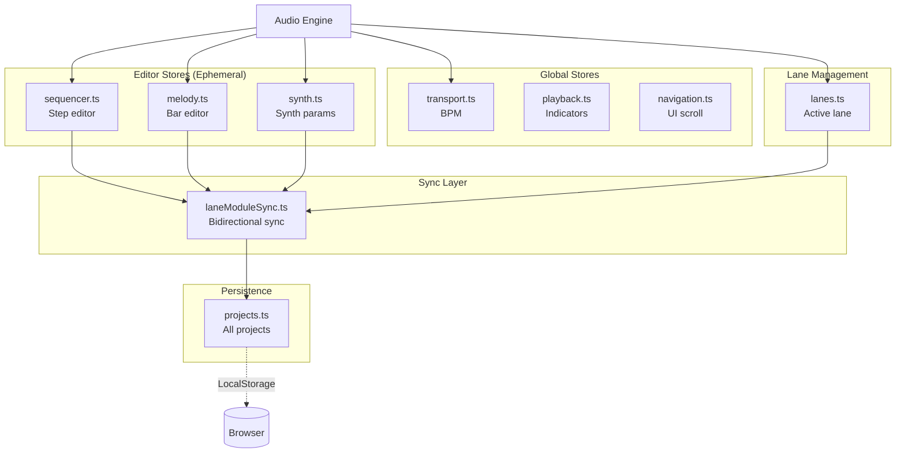
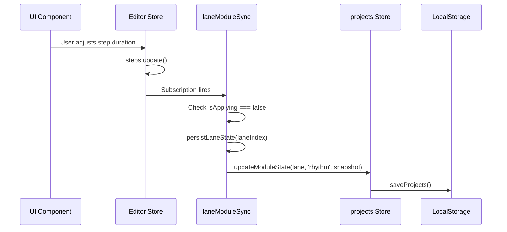
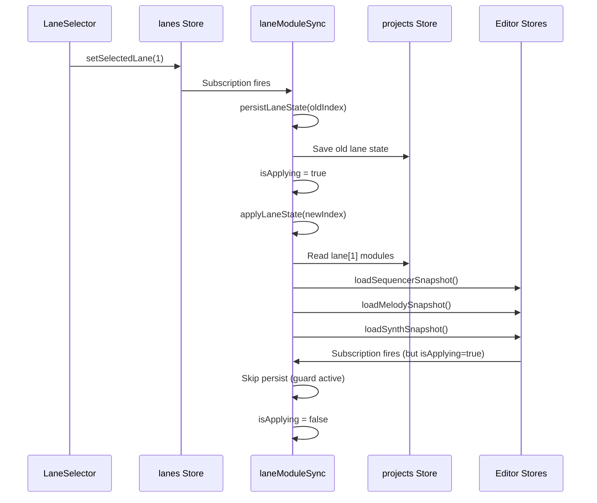
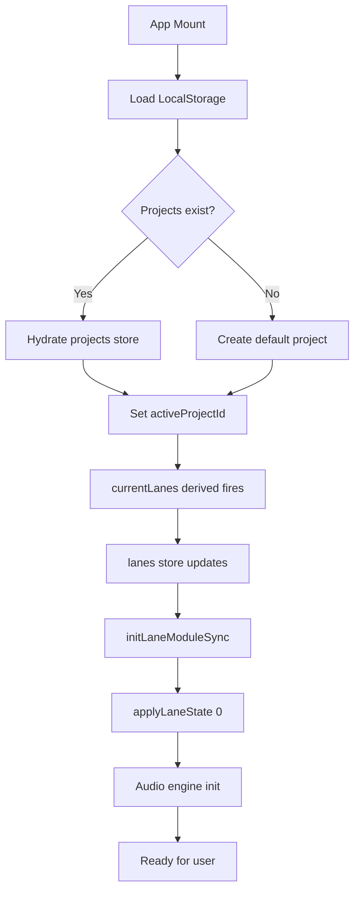

# State Management

## Overview

Lift-Boy uses **Svelte stores** for all state management. The state is divided into two categories:

1. **Editor Stores**: Temporary editing state (UI-focused)
2. **Project Stores**: Persistent project data (saved to LocalStorage)

A **synchronization layer** (`laneModuleSync.ts`) bridges the two.

## Store Architecture



## Store Responsibility Matrix

| Store | Purpose | Scope | Persisted? |
|-------|---------|-------|------------|
| `rhythm/stores/sequencer.ts` | XOX step pattern editor | Current lane | Via sync |
| `rhythm/stores/euclidean.ts` | Euclidean pattern editor | Current lane | Via sync |
| `rhythm/stores/m185.ts` | M185 entries editor | Current lane | Via sync |
| `melody/stores/melody.ts` | Bar sequence editor | Current lane | Via sync |
| `melody/stores/stochastic.ts` | Stochastic parameters editor | Current lane | Via sync |
| `instrument/stores/synth.ts` | Synth parameter editor | Current lane | Via sync |
| `effect/stores/delay.ts` | Delay effect parameters | Current lane | Via sync |
| `effect/stores/reverb.ts` | Reverb effect parameters | Current lane | Via sync |
| `core/stores/session/transport.ts` | BPM value | Global | Yes (in project) |
| `core/stores/session/playback.ts` | UI playback indicators | Global | No |
| `core/stores/session/navigation.ts` | UI section/slide scroll | Global | No |
| `core/stores/session/lanes.ts` | Lane list & selection | Global | Derived from projects |
| `core/stores/data/projects.ts` | All project data | Global | Yes (LocalStorage) |
| `core/stores/sync/laneModuleSync.ts` | Module-aware editor ↔ project sync | Internal | No (logic only) |

## Editor Stores (Ephemeral)

Editor stores are **module-specific** and represent the currently active lane only. The sync layer loads/saves the appropriate snapshot based on active module type.

### Rhythm Module Stores

**rhythm/stores/sequencer.ts** (XOX Step Sequencer):
```typescript
{
  steps: StepState[64],
  selectedStep: number,
  sequencerSettings: {
    length: number,        // 1-64
    clockIndex: number,    // 0-3
    orderIndex: number     // 0-2
  }
}
// Functions: toggleStepActive(), adjustStepDuration(), etc.
```

**rhythm/stores/euclidean.ts** (Euclidean Generator):
```typescript
{
  euclideanSteps: number,      // 1-32
  euclideanPulses: number,     // 0-32
  euclideanRotation: number,   // 0-31
  euclideanSettings: {
    clockIndex: number
  }
}
// Functions: adjustEuclideanSteps(), adjustEuclideanPulses(), etc.
```

**rhythm/stores/m185.ts** (M185 Sequencer):
```typescript
{
  m185Entries: M185Entry[],
  selectedEntry: number,
  m185Settings: {
    clockIndex: number
  }
}
// Functions: selectEntry(), adjustEntryMode(), etc.
```

### Melody Module Stores

**melody/stores/melody.ts** (Basic Melody):
```typescript
{
  bars: BarState[32],
  selectedBar: number,
  melodySettings: {
    length: number,
    skipIndex: number,
    orderIndex: number
  }
}
// Functions: selectBar(), adjustBarNote(), toggleGlide(), etc.
```

**melody/stores/stochastic.ts** (Random Generator):
```typescript
{
  stochasticMinNote: number,      // 0-7
  stochasticMaxNote: number,      // 0-7
  stochasticChangeProb: number,   // 0-100
  stochasticCurrentNote: number,
  stochasticSettings: {
    clockIndex: number
  }
}
// Functions: adjustStochasticMinNote(), adjustStochasticChangeProb(), etc.
```

### Instrument & Effect Stores

**instrument/stores/synth.ts**:
```typescript
{
  synthSettings: {
    wave: WaveType,
    harmonicity: number,
    modulationIndex: number,
    envelope: { attack, decay, sustain, release },
    portamento: number
  }
}
```

**effect/stores/delay.ts** & **effect/stores/reverb.ts**:
```typescript
// Delay
{ delayTime, delayFeedback, delayMix }
// Reverb
{ reverbRoomSize, reverbDecay, reverbMix, reverbPreDelay }
```

**Snapshot Pattern**: All stores provide:
- `get{Module}Snapshot()` - Capture current state
- `load{Module}Snapshot()` - Apply saved state
- `create{Module}Snapshot()` - Generate defaults
clockLabel      // "1/4" | "1/8" | "1/16" | "1/32"
```

**Snapshot Functions**:
```typescript
getSequencerSnapshot(): SequencerSnapshot
loadSequencerSnapshot(snapshot?: SequencerSnapshot)
```

### melody.ts

**Purpose**: Manage bar-based melody sequence editing.

**State**:
```typescript
{
  bars: BarState[32],             // Bar grid
  selectedBar: number,            // Currently selected bar
  melodySettings: {
    length: number,               // 1-32
    skipIndex: number,            // 0-4 (none, 2x, 3x, 4x)
    orderIndex: number            // 0-2 (forward, backward, random)
  }
}
```

**Key Functions**:
```typescript
selectBar(index: number)
adjustBarValue(delta: number)     // Change pitch (0-7)
toggleBarGlide(index?: number)
toggleBarRandomize(index?: number)
setMelodyLength(length: number)
setSkipDivisor(index: number)
setMelodyOrder(index: number)
```

**Derived Stores**:
```typescript
activeBar           // Current bar being edited
barOrderLabel       // Playback order label
skipDivisorLabel    // "None" | "2x" | "3x" | "4x"
```

**Snapshot Functions**:
```typescript
getMelodySnapshot(): MelodySnapshot
loadMelodySnapshot(snapshot?: MelodySnapshot)
```

### synth.ts

**Purpose**: Manage FM synth parameter editing.

**State**:
```typescript
{
  oscillator: {
    wave: WaveType,               // "sine" | "square" | "triangle" | "sawtooth" | "amtriangle"
    harmonicity: number           // 0-2
  },
  modulation: {
    wave: WaveType,
    index: number                 // 0-10
  },
  envelope: {
    attack: number,               // 0-2
    decay: number,                // 0-2
    sustain: number,              // 0-1
    release: number               // 0-10
  },
  portamento: number              // 0-1
}
```

**Key Functions**:
```typescript
setOscillatorWave(wave: WaveType)
adjustHarmonicity(delta: number)
setModulationWave(wave: WaveType)
adjustModulationIndex(delta: number)
adjustAttack(delta: number)
adjustDecay(delta: number)
adjustSustain(delta: number)
adjustRelease(delta: number)
adjustPortamento(delta: number)
```

**Derived Stores**:
```typescript
currentWaveform     // Current oscillator wave
envelopeSettings    // ADSR values
```

**Snapshot Functions**:
```typescript
getSynthSnapshot(): SynthSnapshot
loadSynthSnapshot(snapshot?: SynthSnapshot)
```

## Global Stores

### transport.ts

**Purpose**: Master clock BPM control.

**State**:
```typescript
{
  bpm: number  // 40-240
}
```

**Key Functions**:
```typescript
setBpm(value: number)
adjustBpm(delta: number)
```

**Usage**: Synced to `Tone.Transport.bpm` by audio engine.

### playback.ts

**Purpose**: UI playback indicators (which step/bar is playing).

**State**:
```typescript
{
  playingStep: number | null,     // Currently playing step
  playingBar: number | null       // Currently playing bar
}
```

**Key Functions**:
```typescript
setPlayingStep(index: number | null)
setPlayingBar(index: number | null)
clearPlayback()
```

**Usage**: Updated by audio engine during playback.

### navigation.ts

**Purpose**: Track UI scroll state (section/slide).

**State**:
```typescript
{
  currentSection: SectionKind,    // "xox" | "melody" | "synth"
  currentSlideIndex: number,      // Which slide in the section
  maxSlideIndexPerSection: Record<SectionKind, number>
}
```

**Key Functions**:
```typescript
setSection(section: SectionKind)
setSlideIndex(index: number)
navigateSection(direction: 1 | -1)
navigateSlide(direction: 1 | -1)
```

**Usage**: Synced with keyboard navigation and scroll events.

## Lane Management

### lanes.ts

**Purpose**: Manage lane list and active lane selection.

**State**:
```typescript
{
  lanes: Lane[],                  // All lanes (derived from currentProject)
  selectedLaneIndex: number       // 0-3
}
```

**Key Functions**:
```typescript
setSelectedLane(index: number)
```

**Derived From**: `projects.currentProject.lanes`

**Note**: Lanes are **not** directly editable here. They're derived from the active project.

## Persistence

### projects.ts

**Purpose**: All project data and persistence.

**State**:
```typescript
{
  projects: Project[],            // All saved projects
  activeProjectId: string | null  // Currently selected project
}
```

**Key Functions**:
```typescript
createProject(name: string)
duplicateProject(projectId: string)
deleteProject(projectId: string)
setActiveProject(projectId: string)
updateModuleState(laneIndex, category, state)
updateMixerSettings(laneIndex, mixer)
```

**Derived Stores**:
```typescript
currentProject      // Active project object
currentLanes        // Active project's lanes
```

**Persistence**:
- Automatically saves to `localStorage` on any update
- Key: `liftboy.projects.v1`
- Format: JSON serialized `ProjectsSnapshot`

**Schema**:
```typescript
interface Project {
  id: string;
  name: string;
  tempo: number;
  lanes: Lane[];
  meta: {
    createdAt: string;
    updatedAt: string;
  };
}

interface Lane {
  id: string;
  name: string;
  order: number;
  modules: {
    rhythm: ModuleInstance;
    melody: ModuleInstance;
    instrument: ModuleInstance;
    effect: ModuleInstance;
  };
  mixer: {
    volume: number;
    pan: number;
    mode: "on" | "mute" | "solo";
  };
}

interface ModuleInstance {
  id: string;
  definitionId: string;
  state: unknown;           // JSON-serializable module state
  bypassed: boolean;
}
```

## Synchronization Layer

### laneModuleSync.ts

**Purpose**: Keep editor stores in sync with project store.

**Critical Feature**: **Bidirectional sync** without infinite loops.

#### Sync Flow Diagrams

**User Edits in UI (Persist Direction)**:


**User Switches Lane (Apply Direction)**:


#### Key Implementation Details

**Guard Flag**:
```typescript
let isApplying = false;  // Prevents circular updates
```

**Persist Logic**:
```typescript
const handleRhythmChange = () => {
  if (isApplying) return;  // Guard: skip if we're loading
  persistLaneState(activeLaneIndex);
};

sequencer.subscribe(handleRhythmChange);
```

**Apply Logic**:
```typescript
function applyLaneState(laneIndex: number) {
  isApplying = true;  // Set guard

  const lane = currentLanes[laneIndex];

  // Load snapshots from lane.modules[category].state
  loadSequencerSnapshot(lane.modules.rhythm.state);
  loadMelodySnapshot(lane.modules.melody.state);
  loadSynthSnapshot(lane.modules.instrument.state);

  isApplying = false;  // Clear guard
}
```

**Why This Works**:
1. User switches lane → `applyLaneState()` called
2. `isApplying = true` set **before** loading snapshots
3. `loadSequencerSnapshot()` updates editor store
4. Editor store subscription fires → `handleRhythmChange()` called
5. Guard check: `if (isApplying) return;` **prevents** persist
6. After all loads complete, `isApplying = false`
7. Now user can edit and changes will persist normally

#### Functions

**initLaneModuleSync()**:
```typescript
// Called once on app startup
export function initLaneModuleSync() {
  // Subscribe to editor stores
  sequencer.subscribe(handleRhythmChange);
  melody.subscribe(handleMelodyChange);
  synth.subscribe(handleInstrumentChange);

  // Subscribe to lane changes
  lanes.subscribe(handleLaneSwitch);

  // Load initial lane state
  applyLaneState(0);
}
```

**persistLaneState(laneIndex)**:
```typescript
// Save editor state to projects store
function persistLaneState(laneIndex: number) {
  const rhythmSnapshot = getSequencerSnapshot();
  const melodySnapshot = getMelodySnapshot();
  const synthSnapshot = getSynthSnapshot();

  updateModuleState(laneIndex, 'rhythm', rhythmSnapshot);
  updateModuleState(laneIndex, 'melody', melodySnapshot);
  updateModuleState(laneIndex, 'instrument', synthSnapshot);
}
```

**applyLaneState(laneIndex)**:
```typescript
// Load lane state into editor stores
function applyLaneState(laneIndex: number) {
  isApplying = true;

  const lane = currentLanes[laneIndex];

  loadSequencerSnapshot(lane.modules.rhythm.state);
  loadMelodySnapshot(lane.modules.melody.state);
  loadSynthSnapshot(lane.modules.instrument.state);

  isApplying = false;
}
```

## Store Usage Patterns

### Reading Store Values

**In Components**:
```svelte
<script>
  import { steps } from '$lib/stores/sequencer';
</script>

{#each $steps as step}
  <div class:active={step.active}>{step.id}</div>
{/each}
```

**In Functions**:
```typescript
import { get } from 'svelte/store';
import { steps } from '$lib/stores/sequencer';

function doSomething() {
  const currentSteps = get(steps);
  console.log(currentSteps);
}
```

### Updating Store Values

**Direct Set** (rare):
```typescript
import { bpm } from '$lib/stores/transport';
bpm.set(120);
```

**Update Function** (common):
```typescript
import { steps } from '$lib/stores/sequencer';

steps.update(s => s.map((step, i) =>
  i === 5 ? { ...step, active: true } : step
));
```

**Helper Functions** (preferred):
```typescript
import { toggleStepActive } from '$lib/stores/sequencer';
toggleStepActive(5);
```

### Subscribing to Stores

**In Components** (auto-unsubscribe):
```svelte
<script>
  import { bpm } from '$lib/stores/transport';
  // $bpm syntax auto-subscribes
</script>

<div>BPM: {$bpm}</div>
```

**In Functions** (manual unsubscribe):
```typescript
import { bpm } from '$lib/stores/transport';

const unsubscribe = bpm.subscribe(value => {
  console.log('BPM changed:', value);
});

// Later...
unsubscribe();
```

### Derived Stores

**Creating Derived Store**:
```typescript
import { derived } from 'svelte/store';
import { steps, selectedStep } from './sequencer';

export const activeStep = derived(
  [steps, selectedStep],
  ([$steps, $selected]) => $steps[$selected]
);
```

**Why Use Derived?**
- Computed values auto-update
- Prevents recalculation on every render
- Can combine multiple stores

**Example**:
```typescript
// Instead of calculating in component every time
const active = $steps[$selectedStep];  // Recalcs on every render

// Use derived (calculates once when dependencies change)
const $activeStep = activeStep;  // Efficient
```

## State Initialization

### App Startup Sequence



### Persistence Initialization

**On Load**:
```typescript
// services/projectPersistence.ts
export function loadProjects(): ProjectsSnapshot {
  const json = localStorage.getItem('liftboy.projects.v1');
  if (!json) return { projects: [], activeProjectId: null };

  const data = JSON.parse(json);
  return hydrateProjectSnapshot(data);  // Validate & sanitize
}
```

**On Save**:
```typescript
export function saveProjects(snapshot: ProjectsSnapshot) {
  const json = JSON.stringify(snapshot);
  localStorage.setItem('liftboy.projects.v1', json);
}
```

**Auto-Save**:
```typescript
// projects.ts
projects.subscribe(state => {
  saveProjects({
    projects: state.projects,
    activeProjectId: state.activeProjectId
  });
});
```

Every project/lane change automatically persists to LocalStorage.

## Common Patterns

### Pattern 1: Adjust Numeric Value

```typescript
export function adjustStepDuration(delta: number) {
  steps.update(s => s.map((step, i) =>
    i === get(selectedStep)
      ? { ...step, duration: clamp(step.duration + delta, 0.25, 4) }
      : step
  ));
}
```

**Key Points**:
- Uses `update()` for immutable change
- Spreads object to avoid mutation
- Clamps value to valid range

### Pattern 2: Toggle Boolean

```typescript
export function toggleStepActive(index?: number) {
  const targetIndex = index ?? get(selectedStep);
  steps.update(s => s.map((step, i) =>
    i === targetIndex
      ? { ...step, active: !step.active }
      : step
  ));
}
```

**Key Points**:
- Optional parameter (defaults to selected)
- Toggles boolean via `!`

### Pattern 3: Multi-Store Update

```typescript
export function setPatternLength(length: number) {
  sequencerSettings.update(s => ({ ...s, length: clamp(length, 1, 64) }));
  // Also clear selection if out of range
  if (get(selectedStep) >= length) {
    selectedStep.set(0);
  }
}
```

**Key Points**:
- Multiple stores can be updated in sequence
- Check consistency after updates

## Debugging State

### Browser Console

```javascript
// Inspect stores (use $store syntax in components)
import { get } from 'svelte/store';
import { steps } from '$lib/stores/sequencer';
console.log(get(steps));

// Watch for changes
steps.subscribe(v => console.log('Steps:', v));

// Check persistence
localStorage.getItem('liftboy.projects.v1');
```

### Svelte DevTools

Install [Svelte DevTools](https://github.com/sveltejs/svelte-devtools) browser extension to:
- Inspect store values live
- See component tree
- Track store subscriptions

### Common Issues

**Issue**: State changes not persisting
**Cause**: `laneModuleSync` not initialized
**Fix**: Ensure `initLaneModuleSync()` called on app mount

**Issue**: Circular update loop
**Cause**: Missing `isApplying` guard
**Fix**: Check all sync subscriptions use guard

**Issue**: Stale state in component
**Cause**: Using `get()` instead of reactive `$store`
**Fix**: Use `$store` in component templates

## Performance Considerations

### Store Subscription Efficiency

**Problem**: Too many subscriptions can slow down updates.

**Solution**:
- Use derived stores to combine values
- Unsubscribe when components unmount (automatic with `$store`)
- Avoid subscribing in tight loops

### LocalStorage Write Frequency

**Problem**: Writing to LocalStorage on every keystroke is slow.

**Solution**: Already handled by Svelte's batched updates. Changes are grouped before subscription fires.

**Alternative**: Add manual debounce if needed:
```typescript
let saveTimeout: number;
projects.subscribe(state => {
  clearTimeout(saveTimeout);
  saveTimeout = setTimeout(() => saveProjects(state), 500);
});
```

## Further Reading

- [Svelte Stores Tutorial](https://svelte.dev/tutorial/writable-stores)
- [Audio Engine](AUDIO_ENGINE.md) - How stores connect to audio
- [Architecture](ARCHITECTURE.md) - Overall system design
